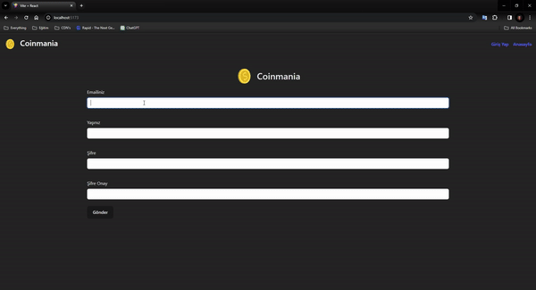

# COIN APP
I created a coin app with React. 

As seen in the design, I used formik to control the form field and yup library to control the input rules. 
Afterwards, I edited the dynamics of the information coming from the API. Finally, I created my tables with Chart.js and completed the project.

## Screen

## Libraries
- bootstrap / formik / yup / react-router-dom / chart.js / react-chartjs-2 / react-icons / millify

## Sources
- API: https://docs.coincap.io/# coin-app
